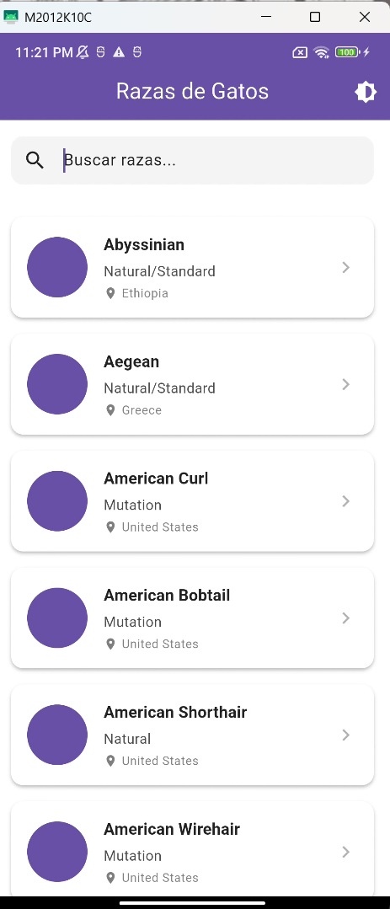
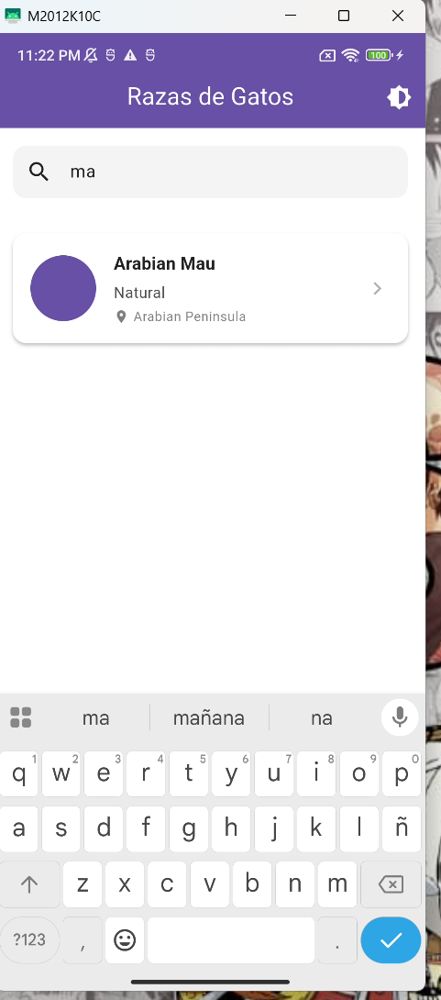
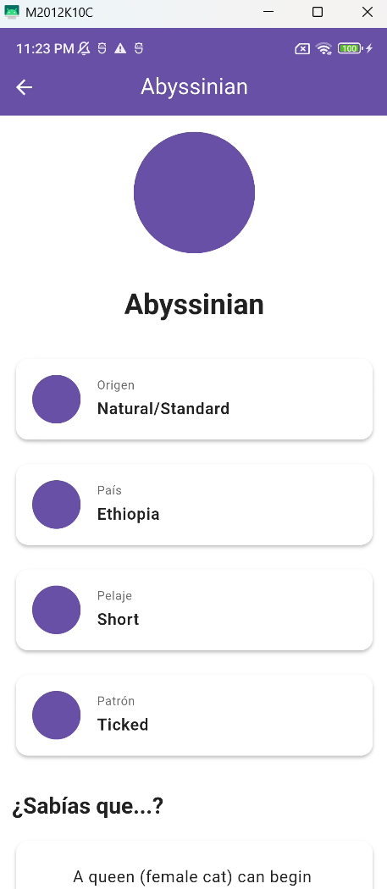
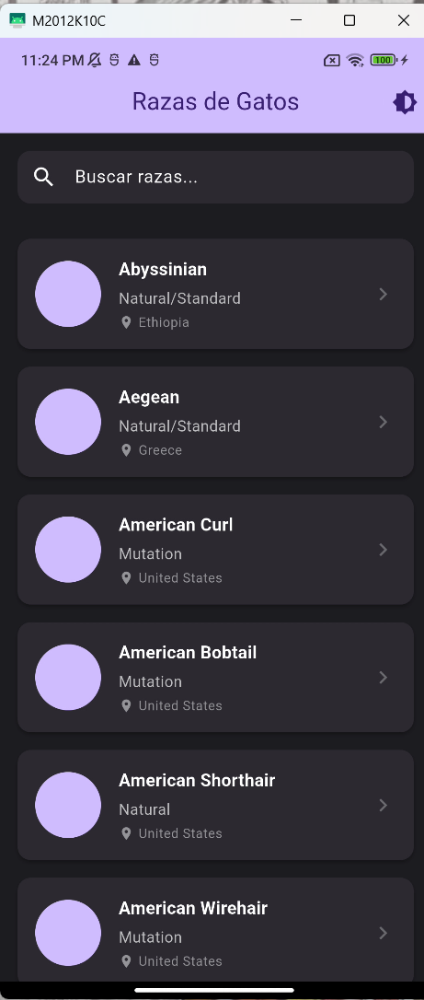

# Cat Directory App

Aplicación Flutter que consume la API pública de [catfact.ninja](https://catfact.ninja) para mostrar un directorio de razas de gatos con datos curiosos.

---

## Requisitos previos

- Flutter SDK `>=3.0.0`
- Dart SDK `>=3.0.0`
- Android SDK / Xcode (según la plataforma destino)
- Conexión a internet (la app consume una API externa)

---

## Instrucciones para ejecutar el proyecto

```bash
# 1. Clonar el repositorio
git clone <url-del-repositorio>
cd cat_directory_app

# 2. Instalar dependencias
flutter pub get

# 3. Generar código automático (modelos Freezed y JSON serialization)
dart run build_runner build --delete-conflicting-outputs

# 4. Verificar que haya un dispositivo o emulador disponible
flutter devices

# 5. Ejecutar la aplicación
flutter run
```

> Si se realizan cambios en los modelos anotados con `@freezed` o `@JsonSerializable`, volver a ejecutar el paso 3.

---

## Arquitectura

La aplicación sigue **Clean Architecture** con separación estricta de capas:

```
lib/
├── core/        # Constantes, tipos Result, excepciones base
├── data/        # Modelos, repositorios e implementaciones, caché
├── logic/       # BLoCs: gestión de estado por funcionalidad
└── ui/          # Pantallas y widgets reutilizables
```

Cada capa solo conoce a la capa inmediatamente inferior. La UI no accede a los repositorios directamente, y los repositorios no conocen a los BLoCs. Esto permite cambiar la fuente de datos o la librería de red sin tocar la UI.

---

## Gestor de estado: BLoC

Se eligió **flutter_bloc** por las siguientes razones:

- **Separación clara de responsabilidades**: eventos, estados y lógica están completamente desacoplados de los widgets.
- **Predecibilidad**: el estado es inmutable y solo cambia mediante eventos explícitos, lo que facilita el debugging y el rastreo de flujos.
- **Soporte para concurrencia**: con `bloc_concurrency` se utiliza el transformador `droppable()`, que descarta eventos duplicados mientras uno ya está siendo procesado. Esto es crítico para el infinite scroll, donde múltiples disparos del listener de scroll no deben generar peticiones redundantes.
- **Escalabilidad**: cada funcionalidad tiene su propio BLoC (`BreedsBloc`, `FactBloc`, `ThemeBloc`), lo que mantiene el código cohesivo y fácil de mantener.


## Funcionalidades implementadas

- Listado de razas con infinite scroll (carga automática al 80% del scroll)
- Skeleton loaders con animación shimmer durante la carga inicial
- Pull-to-refresh para recargar el listado
- Búsqueda/filtrado local por nombre de raza
- Pantalla de detalle con animación Hero compartida en el ícono
- Dato curioso aleatorio por raza con timeout de 10 segundos y opción de reintentar
- Caché persistente de la primera página con expiración de 24 horas
- Soporte para modo claro y oscuro (responde al sistema y tiene toggle manual)
- Manejo de errores diferenciado: timeout, sin conexión, error de servidor

---

## Capturas de pantalla





---

## Tests unitarios

> **Nota:** Los tests unitarios no fueron incluidos en esta entrega debido a un conflicto de versiones entre `bloc_test` y las versiones de `flutter_test` resueltas en el ambiente de desarrollo local. Al ejecutar `flutter test`, el resolver de dependencias genera incompatibilidades con los overrides transitivos de `meta` y `test_api` que impiden la compilación del suite de pruebas.

En un proyecto en producción se implementarían con:

- `bloc_test` para pruebas de BLoCs (estados emitidos por evento)
- `mocktail` para mockear repositorios y servicios
- Tests de widgets con `flutter_test`

Ejemplo del test que se implementaría para `BreedsBloc`:

```dart
blocTest<BreedsBloc, BreedsState>(
  'emite [loading, success] cuando LoadInitialBreeds tiene éxito',
  build: () => BreedsBloc(
    repository: mockRepository,
    cacheService: mockCacheService,
  ),
  act: (bloc) => bloc.add(const LoadInitialBreeds()),
  expect: () => [
    const BreedsState(status: BreedsStatus.loading),
    BreedsState(
      status: BreedsStatus.success,
      breeds: mockBreeds,
      filteredBreeds: mockBreeds,
    ),
  ],
);
```


